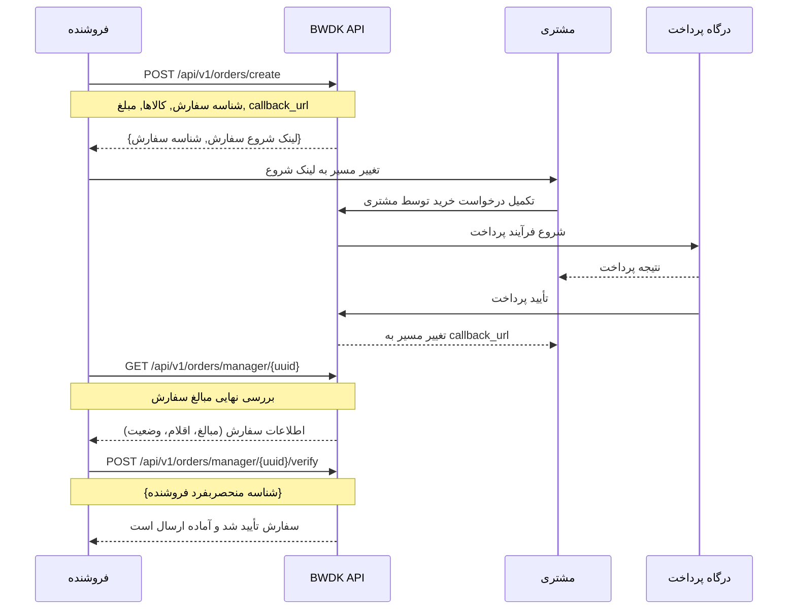
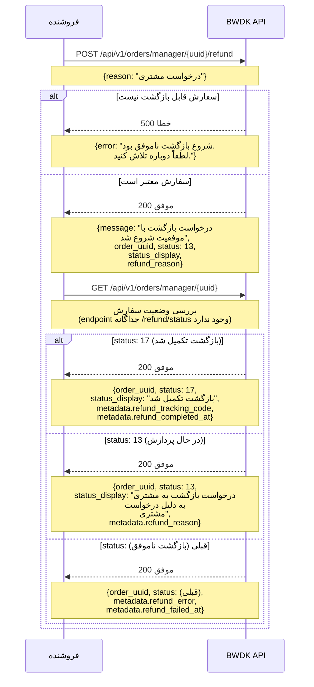
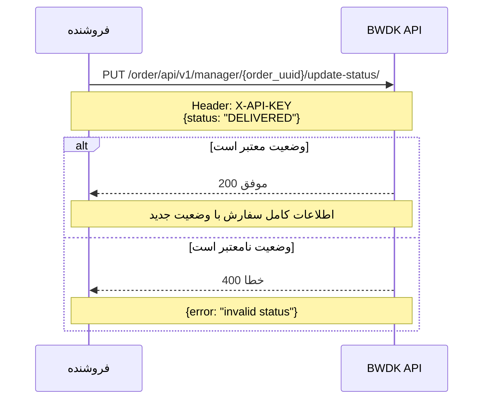

# bwdk_sdk.MerchantOrdersApi

All URIs are relative to *https://bwdk-backend.digify.shop*

Method | HTTP request | Description
------------- | ------------- | -------------
[**order_api_v1_create_order_create**](MerchantOrdersApi.md#order_api_v1_create_order_create) | **POST** /order/api/v1/create-order/ | ساخت سفارش
[**order_api_v1_manager_list**](MerchantOrdersApi.md#order_api_v1_manager_list) | **GET** /order/api/v1/manager/ | لیست سفارشات
[**order_api_v1_manager_paid_list**](MerchantOrdersApi.md#order_api_v1_manager_paid_list) | **GET** /order/api/v1/manager/paid/ | سفارش پرداخت‌شده و تایید‌نشده
[**order_api_v1_manager_refund_create**](MerchantOrdersApi.md#order_api_v1_manager_refund_create) | **POST** /order/api/v1/manager/{order_uuid}/refund/ | بازگشت سفارش
[**order_api_v1_manager_retrieve**](MerchantOrdersApi.md#order_api_v1_manager_retrieve) | **GET** /order/api/v1/manager/{order_uuid}/ | دریافت سفارش
[**order_api_v1_manager_update_status_update**](MerchantOrdersApi.md#order_api_v1_manager_update_status_update) | **PUT** /order/api/v1/manager/{order_uuid}/update-status/ | Update Order Status
[**order_api_v1_manager_verify_create**](MerchantOrdersApi.md#order_api_v1_manager_verify_create) | **POST** /order/api/v1/manager/{order_uuid}/verify/ | تایید سفارش


# **order_api_v1_create_order_create**
> OrderCreateResponse order_api_v1_create_order_create(order_create)

ساخت سفارش

<div dir="rtl" style="text-align: right;">

ساخت سفارش جدید در سیستم BWDK

## توضیحات

این endpoint برای ایجاد یک سفارش جدید در سیستم خرید با دیجی‌کالا استفاده می‌شود. در این درخواست باید اطلاعات سفارش، اقلام سبد خرید، و آدرس callback شامل شود.

برای شروع ارتباط با سرویس‌های **خرید با دیجی‌کالا** شما باید دارای **API_KEY** باشید که این مورد از سمت تیم دیجی‌فای در اختیار شما قرار خواهد گرفت.

### روند کاری

**مرحله ۱: درخواست ساخت سفارش**

کاربر پس از انتخاب کالاهای خود در سبد خرید، بر روی دکمه **خرید با دیجی‌کالا** کلیک می‌کند و بک‌اند مرچنت درخواستی برای ساخت سفارش BWDK دریافت می‌کند. در این مرحله اولین درخواست خود را به بک‌اند BWDK ارسال می‌نمایید:

BWDK یک سفارش جدید برای مرچنت با وضعیت **INITIAL** ایجاد می‌کند و **order_uuid** را جنریت می‌کند. آدرس **order_start_url** نقطه شروع مسیر تکمیل سفارش است (انتخاب آدرس، شیپینگ، پکینگ، پرداخت و غیره).

**مرحله ۲: بررسی نهایی سفارش پیش از تأیید**

پس از اینکه مشتری فرآیند پرداخت را تکمیل کرد و به **callback_url** هدایت شد، بک‌اند مرچنت باید پیش از فراخوانی verify، یک‌بار سفارش را دریافت کرده و مبالغ نهایی (شامل هزینه کالاها، شیپینگ، تخفیف‌ها و جمع کل) را با اطلاعات سمت مرچنت تطبیق دهد تا از صحت تراکنش اطمینان حاصل شود.

**مرحله ۳: تأیید سفارش**

پس از تطبیق موفق مبالغ، درخواست verify ارسال می‌شود تا سفارش نهایی و آماده ارسال گردد.
<br>
</div>



</div>


### Example

* Api Key Authentication (MerchantAPIKeyAuth):

```python
import bwdk_sdk
from bwdk_sdk.models.order_create import OrderCreate
from bwdk_sdk.models.order_create_response import OrderCreateResponse
from bwdk_sdk.rest import ApiException
from pprint import pprint

# Defining the host is optional and defaults to https://bwdk-backend.digify.shop
# See configuration.py for a list of all supported configuration parameters.
configuration = bwdk_sdk.Configuration(
    host = "https://bwdk-backend.digify.shop"
)

# The client must configure the authentication and authorization parameters
# in accordance with the API server security policy.
# Examples for each auth method are provided below, use the example that
# satisfies your auth use case.

# Configure API key authorization: MerchantAPIKeyAuth
configuration.api_key['MerchantAPIKeyAuth'] = os.environ["API_KEY"]

# Uncomment below to setup prefix (e.g. Bearer) for API key, if needed
# configuration.api_key_prefix['MerchantAPIKeyAuth'] = 'Bearer'

# Enter a context with an instance of the API client
with bwdk_sdk.ApiClient(configuration) as api_client:
    # Create an instance of the API class
    api_instance = bwdk_sdk.MerchantOrdersApi(api_client)
    order_create = bwdk_sdk.OrderCreate() # OrderCreate | 

    try:
        # ساخت سفارش
        api_response = api_instance.order_api_v1_create_order_create(order_create)
        print("The response of MerchantOrdersApi->order_api_v1_create_order_create:\n")
        pprint(api_response)
    except Exception as e:
        print("Exception when calling MerchantOrdersApi->order_api_v1_create_order_create: %s\n" % e)
```


### Parameters


Name | Type | Description  | Notes
------------- | ------------- | ------------- | -------------
 **order_create** | [**OrderCreate**](OrderCreate.md)|  | 

### Return type

[**OrderCreateResponse**](OrderCreateResponse.md)

### Authorization

[MerchantAPIKeyAuth](../README.md#MerchantAPIKeyAuth)

### HTTP request headers

 - **Content-Type**: application/json, application/x-www-form-urlencoded, multipart/form-data
 - **Accept**: application/json

### HTTP response details

| Status code | Description | Response headers |
|-------------|-------------|------------------|
**201** |  |  -  |

[[Back to top]](#) [[Back to API list]](../README.md#documentation-for-api-endpoints) [[Back to Model list]](../README.md#documentation-for-models) [[Back to README]](../README.md)

# **order_api_v1_manager_list**
> PaginatedOrderDetailList order_api_v1_manager_list(cities=cities, created_at=created_at, cursor=cursor, order_ids=order_ids, ordering=ordering, payment_types=payment_types, provinces=provinces, reference_code=reference_code, search=search, shipping_types=shipping_types, status=status, statuses=statuses, today_pickup=today_pickup)

لیست سفارشات

<div dir="rtl" style="text-align: right;">

لیست سفارشات فروشنده

## توضیحات

این endpoint لیست تمام سفارشات مرتبط با فروشنده را با امکان فیلتر، جستجو و مرتب‌سازی برمی‌گرداند. نتایج به صورت صفحه‌بندی‌شده (Cursor Pagination) ارسال می‌شوند و به ترتیب جدیدترین سفارش اول مرتب می‌شوند.

نیاز به **API_KEY** فروشنده دارد.

## پارامترهای فیلتر

* **status**: وضعیت سفارش (INITIAL, PENDING, PAID_BY_USER, VERIFIED_BY_MERCHANT, ...)
* **created_at__gte / created_at__lte**: فیلتر بر اساس تاریخ ایجاد
* **search**: جستجو در شماره تلفن مشتری، نام، کد مرجع، شناسه سفارش مرچنت
* **ordering**: مرتب‌سازی بر اساس created_at, final_amount, status, merchant_order_id

</div>


### Example

* Api Key Authentication (MerchantAPIKeyAuth):

```python
import bwdk_sdk
from bwdk_sdk.models.paginated_order_detail_list import PaginatedOrderDetailList
from bwdk_sdk.rest import ApiException
from pprint import pprint

# Defining the host is optional and defaults to https://bwdk-backend.digify.shop
# See configuration.py for a list of all supported configuration parameters.
configuration = bwdk_sdk.Configuration(
    host = "https://bwdk-backend.digify.shop"
)

# The client must configure the authentication and authorization parameters
# in accordance with the API server security policy.
# Examples for each auth method are provided below, use the example that
# satisfies your auth use case.

# Configure API key authorization: MerchantAPIKeyAuth
configuration.api_key['MerchantAPIKeyAuth'] = os.environ["API_KEY"]

# Uncomment below to setup prefix (e.g. Bearer) for API key, if needed
# configuration.api_key_prefix['MerchantAPIKeyAuth'] = 'Bearer'

# Enter a context with an instance of the API client
with bwdk_sdk.ApiClient(configuration) as api_client:
    # Create an instance of the API class
    api_instance = bwdk_sdk.MerchantOrdersApi(api_client)
    cities = 'cities_example' # str |  (optional)
    created_at = '2013-10-20' # date |  (optional)
    cursor = 'cursor_example' # str | مقدار نشانگر صفحه‌بندی. (optional)
    order_ids = 'order_ids_example' # str |  (optional)
    ordering = 'ordering_example' # str | کدام فیلد باید هنگام مرتب‌سازی نتایج استفاده شود. (optional)
    payment_types = 'payment_types_example' # str |  (optional)
    provinces = 'provinces_example' # str |  (optional)
    reference_code = 'reference_code_example' # str |  (optional)
    search = 'search_example' # str | یک عبارت جستجو. (optional)
    shipping_types = 'shipping_types_example' # str |  (optional)
    status = 56 # int | * `1` - اولیه * `2` - شروع شده * `3` - در انتظار * `4` - در انتظار درگاه * `5` - منقضی شده * `6` - لغو شده * `7` - پرداخت‌شده توسط کاربر * `8` - پرداخت موفیت آمیز نبود * `9` - تأیید شده توسط فروشگاه * `10` - تأیید توسط فروشگاه ناموفق بود * `11` - ناموفق از سوی فروشگاه * `12` - لغوشده توسط فروشگاه * `13` - درخواست بازگشت وجه به مشتری به دلیل درخواست مشتری * `14` - درخواست بازگشت وجه به فروشگاه پس از عدم تأیید توسط فروشگاه * `15` - درخواست بازگشت وجه به مشتری پس از ناموفق بودن توسط فروشگاه * `16` - بازپرداخت به فروشگاه پس از لغو توسط فروشگاه * `17` - بازپرداخت تکمیل شد * `18` - زمان انقضا گذشته است * `19` - تحویل شده * `20` - جمع اوری شده و در حال ارسال (optional)
    statuses = 'statuses_example' # str |  (optional)
    today_pickup = True # bool |  (optional)

    try:
        # لیست سفارشات
        api_response = api_instance.order_api_v1_manager_list(cities=cities, created_at=created_at, cursor=cursor, order_ids=order_ids, ordering=ordering, payment_types=payment_types, provinces=provinces, reference_code=reference_code, search=search, shipping_types=shipping_types, status=status, statuses=statuses, today_pickup=today_pickup)
        print("The response of MerchantOrdersApi->order_api_v1_manager_list:\n")
        pprint(api_response)
    except Exception as e:
        print("Exception when calling MerchantOrdersApi->order_api_v1_manager_list: %s\n" % e)
```


### Parameters


Name | Type | Description  | Notes
------------- | ------------- | ------------- | -------------
 **cities** | **str**|  | [optional] 
 **created_at** | **date**|  | [optional] 
 **cursor** | **str**| مقدار نشانگر صفحه‌بندی. | [optional] 
 **order_ids** | **str**|  | [optional] 
 **ordering** | **str**| کدام فیلد باید هنگام مرتب‌سازی نتایج استفاده شود. | [optional] 
 **payment_types** | **str**|  | [optional] 
 **provinces** | **str**|  | [optional] 
 **reference_code** | **str**|  | [optional] 
 **search** | **str**| یک عبارت جستجو. | [optional] 
 **shipping_types** | **str**|  | [optional] 
 **status** | **int**| * &#x60;1&#x60; - اولیه * &#x60;2&#x60; - شروع شده * &#x60;3&#x60; - در انتظار * &#x60;4&#x60; - در انتظار درگاه * &#x60;5&#x60; - منقضی شده * &#x60;6&#x60; - لغو شده * &#x60;7&#x60; - پرداخت‌شده توسط کاربر * &#x60;8&#x60; - پرداخت موفیت آمیز نبود * &#x60;9&#x60; - تأیید شده توسط فروشگاه * &#x60;10&#x60; - تأیید توسط فروشگاه ناموفق بود * &#x60;11&#x60; - ناموفق از سوی فروشگاه * &#x60;12&#x60; - لغوشده توسط فروشگاه * &#x60;13&#x60; - درخواست بازگشت وجه به مشتری به دلیل درخواست مشتری * &#x60;14&#x60; - درخواست بازگشت وجه به فروشگاه پس از عدم تأیید توسط فروشگاه * &#x60;15&#x60; - درخواست بازگشت وجه به مشتری پس از ناموفق بودن توسط فروشگاه * &#x60;16&#x60; - بازپرداخت به فروشگاه پس از لغو توسط فروشگاه * &#x60;17&#x60; - بازپرداخت تکمیل شد * &#x60;18&#x60; - زمان انقضا گذشته است * &#x60;19&#x60; - تحویل شده * &#x60;20&#x60; - جمع اوری شده و در حال ارسال | [optional] 
 **statuses** | **str**|  | [optional] 
 **today_pickup** | **bool**|  | [optional] 

### Return type

[**PaginatedOrderDetailList**](PaginatedOrderDetailList.md)

### Authorization

[MerchantAPIKeyAuth](../README.md#MerchantAPIKeyAuth)

### HTTP request headers

 - **Content-Type**: Not defined
 - **Accept**: application/json

### HTTP response details

| Status code | Description | Response headers |
|-------------|-------------|------------------|
**200** |  |  -  |

[[Back to top]](#) [[Back to API list]](../README.md#documentation-for-api-endpoints) [[Back to Model list]](../README.md#documentation-for-models) [[Back to README]](../README.md)

# **order_api_v1_manager_paid_list**
> PaginatedMerchantPaidOrderListList order_api_v1_manager_paid_list(cities=cities, created_at=created_at, cursor=cursor, order_ids=order_ids, ordering=ordering, payment_types=payment_types, provinces=provinces, reference_code=reference_code, search=search, shipping_types=shipping_types, status=status, statuses=statuses, today_pickup=today_pickup)

سفارش پرداخت‌شده و تایید‌نشده

لیست تمامی سفارشاتی که توسط کاربر پرداخت شده اند ولی توسط فروشنده تایید نشده اند.


### Example

* Api Key Authentication (MerchantAPIKeyAuth):

```python
import bwdk_sdk
from bwdk_sdk.models.paginated_merchant_paid_order_list_list import PaginatedMerchantPaidOrderListList
from bwdk_sdk.rest import ApiException
from pprint import pprint

# Defining the host is optional and defaults to https://bwdk-backend.digify.shop
# See configuration.py for a list of all supported configuration parameters.
configuration = bwdk_sdk.Configuration(
    host = "https://bwdk-backend.digify.shop"
)

# The client must configure the authentication and authorization parameters
# in accordance with the API server security policy.
# Examples for each auth method are provided below, use the example that
# satisfies your auth use case.

# Configure API key authorization: MerchantAPIKeyAuth
configuration.api_key['MerchantAPIKeyAuth'] = os.environ["API_KEY"]

# Uncomment below to setup prefix (e.g. Bearer) for API key, if needed
# configuration.api_key_prefix['MerchantAPIKeyAuth'] = 'Bearer'

# Enter a context with an instance of the API client
with bwdk_sdk.ApiClient(configuration) as api_client:
    # Create an instance of the API class
    api_instance = bwdk_sdk.MerchantOrdersApi(api_client)
    cities = 'cities_example' # str |  (optional)
    created_at = '2013-10-20' # date |  (optional)
    cursor = 'cursor_example' # str | مقدار نشانگر صفحه‌بندی. (optional)
    order_ids = 'order_ids_example' # str |  (optional)
    ordering = 'ordering_example' # str | کدام فیلد باید هنگام مرتب‌سازی نتایج استفاده شود. (optional)
    payment_types = 'payment_types_example' # str |  (optional)
    provinces = 'provinces_example' # str |  (optional)
    reference_code = 'reference_code_example' # str |  (optional)
    search = 'search_example' # str | یک عبارت جستجو. (optional)
    shipping_types = 'shipping_types_example' # str |  (optional)
    status = 56 # int | * `1` - اولیه * `2` - شروع شده * `3` - در انتظار * `4` - در انتظار درگاه * `5` - منقضی شده * `6` - لغو شده * `7` - پرداخت‌شده توسط کاربر * `8` - پرداخت موفیت آمیز نبود * `9` - تأیید شده توسط فروشگاه * `10` - تأیید توسط فروشگاه ناموفق بود * `11` - ناموفق از سوی فروشگاه * `12` - لغوشده توسط فروشگاه * `13` - درخواست بازگشت وجه به مشتری به دلیل درخواست مشتری * `14` - درخواست بازگشت وجه به فروشگاه پس از عدم تأیید توسط فروشگاه * `15` - درخواست بازگشت وجه به مشتری پس از ناموفق بودن توسط فروشگاه * `16` - بازپرداخت به فروشگاه پس از لغو توسط فروشگاه * `17` - بازپرداخت تکمیل شد * `18` - زمان انقضا گذشته است * `19` - تحویل شده * `20` - جمع اوری شده و در حال ارسال (optional)
    statuses = 'statuses_example' # str |  (optional)
    today_pickup = True # bool |  (optional)

    try:
        # سفارش پرداخت‌شده و تایید‌نشده
        api_response = api_instance.order_api_v1_manager_paid_list(cities=cities, created_at=created_at, cursor=cursor, order_ids=order_ids, ordering=ordering, payment_types=payment_types, provinces=provinces, reference_code=reference_code, search=search, shipping_types=shipping_types, status=status, statuses=statuses, today_pickup=today_pickup)
        print("The response of MerchantOrdersApi->order_api_v1_manager_paid_list:\n")
        pprint(api_response)
    except Exception as e:
        print("Exception when calling MerchantOrdersApi->order_api_v1_manager_paid_list: %s\n" % e)
```


### Parameters


Name | Type | Description  | Notes
------------- | ------------- | ------------- | -------------
 **cities** | **str**|  | [optional] 
 **created_at** | **date**|  | [optional] 
 **cursor** | **str**| مقدار نشانگر صفحه‌بندی. | [optional] 
 **order_ids** | **str**|  | [optional] 
 **ordering** | **str**| کدام فیلد باید هنگام مرتب‌سازی نتایج استفاده شود. | [optional] 
 **payment_types** | **str**|  | [optional] 
 **provinces** | **str**|  | [optional] 
 **reference_code** | **str**|  | [optional] 
 **search** | **str**| یک عبارت جستجو. | [optional] 
 **shipping_types** | **str**|  | [optional] 
 **status** | **int**| * &#x60;1&#x60; - اولیه * &#x60;2&#x60; - شروع شده * &#x60;3&#x60; - در انتظار * &#x60;4&#x60; - در انتظار درگاه * &#x60;5&#x60; - منقضی شده * &#x60;6&#x60; - لغو شده * &#x60;7&#x60; - پرداخت‌شده توسط کاربر * &#x60;8&#x60; - پرداخت موفیت آمیز نبود * &#x60;9&#x60; - تأیید شده توسط فروشگاه * &#x60;10&#x60; - تأیید توسط فروشگاه ناموفق بود * &#x60;11&#x60; - ناموفق از سوی فروشگاه * &#x60;12&#x60; - لغوشده توسط فروشگاه * &#x60;13&#x60; - درخواست بازگشت وجه به مشتری به دلیل درخواست مشتری * &#x60;14&#x60; - درخواست بازگشت وجه به فروشگاه پس از عدم تأیید توسط فروشگاه * &#x60;15&#x60; - درخواست بازگشت وجه به مشتری پس از ناموفق بودن توسط فروشگاه * &#x60;16&#x60; - بازپرداخت به فروشگاه پس از لغو توسط فروشگاه * &#x60;17&#x60; - بازپرداخت تکمیل شد * &#x60;18&#x60; - زمان انقضا گذشته است * &#x60;19&#x60; - تحویل شده * &#x60;20&#x60; - جمع اوری شده و در حال ارسال | [optional] 
 **statuses** | **str**|  | [optional] 
 **today_pickup** | **bool**|  | [optional] 

### Return type

[**PaginatedMerchantPaidOrderListList**](PaginatedMerchantPaidOrderListList.md)

### Authorization

[MerchantAPIKeyAuth](../README.md#MerchantAPIKeyAuth)

### HTTP request headers

 - **Content-Type**: Not defined
 - **Accept**: application/json

### HTTP response details

| Status code | Description | Response headers |
|-------------|-------------|------------------|
**200** |  |  -  |

[[Back to top]](#) [[Back to API list]](../README.md#documentation-for-api-endpoints) [[Back to Model list]](../README.md#documentation-for-models) [[Back to README]](../README.md)

# **order_api_v1_manager_refund_create**
> MerchantOrderRefundResponse order_api_v1_manager_refund_create(order_uuid, refund_order=refund_order)

بازگشت سفارش

<div dir="rtl" style="text-align: right;">
بازگشت و لغو سفارش

## توضیحات

این endpoint برای بازگشت یا لغو سفارشی استفاده می‌شود که قبلاً پرداخت شده یا تایید شده است. در این مرحله مبلغ سفارش به کاربر بازگشت داده می‌شود و وضعیت سفارش به **REFUNDED** تغییر می‌یابد.


## شرایط بازگشت

سفارش باید در یکی از وضعیت‌های زیر باشد تا بازگشت امکان‌پذیر باشد:
* **PAID_BY_USER**: سفارش پرداخت شده است اما هنوز تایید نشده
* **VERIFIED_BY_MERCHANT**: سفارش تایید شده است

سفارش نباید قبلاً بازگشت داده شده باشد.

**پاسخ خطا** - اگر سفارش در وضعیت مناسب نباشد یا قبلاً بازگشت داده شده باشد
</div>




### Example

* Api Key Authentication (MerchantAPIKeyAuth):

```python
import bwdk_sdk
from bwdk_sdk.models.merchant_order_refund_response import MerchantOrderRefundResponse
from bwdk_sdk.models.refund_order import RefundOrder
from bwdk_sdk.rest import ApiException
from pprint import pprint

# Defining the host is optional and defaults to https://bwdk-backend.digify.shop
# See configuration.py for a list of all supported configuration parameters.
configuration = bwdk_sdk.Configuration(
    host = "https://bwdk-backend.digify.shop"
)

# The client must configure the authentication and authorization parameters
# in accordance with the API server security policy.
# Examples for each auth method are provided below, use the example that
# satisfies your auth use case.

# Configure API key authorization: MerchantAPIKeyAuth
configuration.api_key['MerchantAPIKeyAuth'] = os.environ["API_KEY"]

# Uncomment below to setup prefix (e.g. Bearer) for API key, if needed
# configuration.api_key_prefix['MerchantAPIKeyAuth'] = 'Bearer'

# Enter a context with an instance of the API client
with bwdk_sdk.ApiClient(configuration) as api_client:
    # Create an instance of the API class
    api_instance = bwdk_sdk.MerchantOrdersApi(api_client)
    order_uuid = UUID('38400000-8cf0-11bd-b23e-10b96e4ef00d') # UUID | 
    refund_order = bwdk_sdk.RefundOrder() # RefundOrder |  (optional)

    try:
        # بازگشت سفارش
        api_response = api_instance.order_api_v1_manager_refund_create(order_uuid, refund_order=refund_order)
        print("The response of MerchantOrdersApi->order_api_v1_manager_refund_create:\n")
        pprint(api_response)
    except Exception as e:
        print("Exception when calling MerchantOrdersApi->order_api_v1_manager_refund_create: %s\n" % e)
```


### Parameters


Name | Type | Description  | Notes
------------- | ------------- | ------------- | -------------
 **order_uuid** | **UUID**|  | 
 **refund_order** | [**RefundOrder**](RefundOrder.md)|  | [optional] 

### Return type

[**MerchantOrderRefundResponse**](MerchantOrderRefundResponse.md)

### Authorization

[MerchantAPIKeyAuth](../README.md#MerchantAPIKeyAuth)

### HTTP request headers

 - **Content-Type**: application/json, application/x-www-form-urlencoded, multipart/form-data
 - **Accept**: application/json

### HTTP response details

| Status code | Description | Response headers |
|-------------|-------------|------------------|
**200** |  |  -  |
**500** |  |  -  |

[[Back to top]](#) [[Back to API list]](../README.md#documentation-for-api-endpoints) [[Back to Model list]](../README.md#documentation-for-models) [[Back to README]](../README.md)

# **order_api_v1_manager_retrieve**
> OrderDetail order_api_v1_manager_retrieve(order_uuid)

دریافت سفارش

<div dir="rtl" style="text-align: right;">

# مدیریت سفارشات

## توضیحات

این endpoint برای مدیریت و مشاهده سفارشات فروشنده استفاده می‌شود.

</div>


### Example

* Api Key Authentication (MerchantAPIKeyAuth):

```python
import bwdk_sdk
from bwdk_sdk.models.order_detail import OrderDetail
from bwdk_sdk.rest import ApiException
from pprint import pprint

# Defining the host is optional and defaults to https://bwdk-backend.digify.shop
# See configuration.py for a list of all supported configuration parameters.
configuration = bwdk_sdk.Configuration(
    host = "https://bwdk-backend.digify.shop"
)

# The client must configure the authentication and authorization parameters
# in accordance with the API server security policy.
# Examples for each auth method are provided below, use the example that
# satisfies your auth use case.

# Configure API key authorization: MerchantAPIKeyAuth
configuration.api_key['MerchantAPIKeyAuth'] = os.environ["API_KEY"]

# Uncomment below to setup prefix (e.g. Bearer) for API key, if needed
# configuration.api_key_prefix['MerchantAPIKeyAuth'] = 'Bearer'

# Enter a context with an instance of the API client
with bwdk_sdk.ApiClient(configuration) as api_client:
    # Create an instance of the API class
    api_instance = bwdk_sdk.MerchantOrdersApi(api_client)
    order_uuid = UUID('38400000-8cf0-11bd-b23e-10b96e4ef00d') # UUID | 

    try:
        # دریافت سفارش
        api_response = api_instance.order_api_v1_manager_retrieve(order_uuid)
        print("The response of MerchantOrdersApi->order_api_v1_manager_retrieve:\n")
        pprint(api_response)
    except Exception as e:
        print("Exception when calling MerchantOrdersApi->order_api_v1_manager_retrieve: %s\n" % e)
```


### Parameters


Name | Type | Description  | Notes
------------- | ------------- | ------------- | -------------
 **order_uuid** | **UUID**|  | 

### Return type

[**OrderDetail**](OrderDetail.md)

### Authorization

[MerchantAPIKeyAuth](../README.md#MerchantAPIKeyAuth)

### HTTP request headers

 - **Content-Type**: Not defined
 - **Accept**: application/json

### HTTP response details

| Status code | Description | Response headers |
|-------------|-------------|------------------|
**200** |  |  -  |

[[Back to top]](#) [[Back to API list]](../README.md#documentation-for-api-endpoints) [[Back to Model list]](../README.md#documentation-for-models) [[Back to README]](../README.md)

# **order_api_v1_manager_update_status_update**
> OrderDetail order_api_v1_manager_update_status_update(order_uuid, update_order_status)

Update Order Status

<div dir="rtl" style="text-align: right;">

بروزرسانی وضعیت سفارش

## توضیحات

این endpoint به فروشنده امکان می‌دهد وضعیت یک سفارش را به‌صورت مستقیم تغییر دهد. این endpoint برای مواردی مانند علامت‌گذاری سفارش به‌عنوان «ارسال شده» یا «تحویل داده شده» توسط فروشنده استفاده می‌شود.

نیاز به **API_KEY** فروشنده دارد.

## وضعیت‌های مجاز

* **DELIVERED**: تحویل شد
* **DISPATCHED**: ارسال شد
* سایر وضعیت‌های تعریف‌شده در سیستم

</div>




### Example

* Api Key Authentication (MerchantAPIKeyAuth):

```python
import bwdk_sdk
from bwdk_sdk.models.order_detail import OrderDetail
from bwdk_sdk.models.update_order_status import UpdateOrderStatus
from bwdk_sdk.rest import ApiException
from pprint import pprint

# Defining the host is optional and defaults to https://bwdk-backend.digify.shop
# See configuration.py for a list of all supported configuration parameters.
configuration = bwdk_sdk.Configuration(
    host = "https://bwdk-backend.digify.shop"
)

# The client must configure the authentication and authorization parameters
# in accordance with the API server security policy.
# Examples for each auth method are provided below, use the example that
# satisfies your auth use case.

# Configure API key authorization: MerchantAPIKeyAuth
configuration.api_key['MerchantAPIKeyAuth'] = os.environ["API_KEY"]

# Uncomment below to setup prefix (e.g. Bearer) for API key, if needed
# configuration.api_key_prefix['MerchantAPIKeyAuth'] = 'Bearer'

# Enter a context with an instance of the API client
with bwdk_sdk.ApiClient(configuration) as api_client:
    # Create an instance of the API class
    api_instance = bwdk_sdk.MerchantOrdersApi(api_client)
    order_uuid = UUID('38400000-8cf0-11bd-b23e-10b96e4ef00d') # UUID | 
    update_order_status = bwdk_sdk.UpdateOrderStatus() # UpdateOrderStatus | 

    try:
        # Update Order Status
        api_response = api_instance.order_api_v1_manager_update_status_update(order_uuid, update_order_status)
        print("The response of MerchantOrdersApi->order_api_v1_manager_update_status_update:\n")
        pprint(api_response)
    except Exception as e:
        print("Exception when calling MerchantOrdersApi->order_api_v1_manager_update_status_update: %s\n" % e)
```


### Parameters


Name | Type | Description  | Notes
------------- | ------------- | ------------- | -------------
 **order_uuid** | **UUID**|  | 
 **update_order_status** | [**UpdateOrderStatus**](UpdateOrderStatus.md)|  | 

### Return type

[**OrderDetail**](OrderDetail.md)

### Authorization

[MerchantAPIKeyAuth](../README.md#MerchantAPIKeyAuth)

### HTTP request headers

 - **Content-Type**: application/json, application/x-www-form-urlencoded, multipart/form-data
 - **Accept**: application/json

### HTTP response details

| Status code | Description | Response headers |
|-------------|-------------|------------------|
**200** |  |  -  |

[[Back to top]](#) [[Back to API list]](../README.md#documentation-for-api-endpoints) [[Back to Model list]](../README.md#documentation-for-models) [[Back to README]](../README.md)

# **order_api_v1_manager_verify_create**
> OrderDetail order_api_v1_manager_verify_create(order_uuid, verify_order)

تایید سفارش

<div dir="rtl" style="text-align: right;">

تایید سفارش پس از پرداخت

## توضیحات

پس از اتمام فرایند پرداخت توسط کاربر، مرچنت باید سفارش را تایید کند. این endpoint برای تایید و نهایی کردن سفارش پس از پرداخت موفق توسط مشتری استفاده می‌شود. در این مرحله مرچنت سفارش را تایید می‌کند و وضعیت سفارش به **VERIFIED_BY_MERCHANT** تغییر می‌یابد.

## روند کاری

**مرحله ۲: بازگشت کاربر و دریافت نتیجه**

پس از تکمیل فرایند پرداخت (موفق یا ناموفق)، کاربر به آدرس callback_url که هنگام ساخت سفارش ارسال کرده بودید بازگردانده می‌شود. در این درخواست وضعیت سفارش به صورت query parameters ارسال می‌شود:


**Query Parameters:**
* **success**: متغیر منطقی نشان‌دهنده موفق یا ناموفق بودن سفارش
* **status**: وضعیت سفارش (PAID، FAILED، وغیره)
* **phone_number**: شماره تلفن مشتری
* **order_uuid**: شناسه یکتای سفارش
* **merchant_order_id**: شناسه سفارش در سیستم مرچنت

**مرحله ۳: تایید سفارش در بک‌اند**

سپس شما باید این endpoint را فراخوانی کنید تا سفارش را تایید کنید و اطمینان حاصل کنید که سفارش موفقیت‌آمیز ثبت شده است:
</div>


### Example

* Api Key Authentication (MerchantAPIKeyAuth):

```python
import bwdk_sdk
from bwdk_sdk.models.order_detail import OrderDetail
from bwdk_sdk.models.verify_order import VerifyOrder
from bwdk_sdk.rest import ApiException
from pprint import pprint

# Defining the host is optional and defaults to https://bwdk-backend.digify.shop
# See configuration.py for a list of all supported configuration parameters.
configuration = bwdk_sdk.Configuration(
    host = "https://bwdk-backend.digify.shop"
)

# The client must configure the authentication and authorization parameters
# in accordance with the API server security policy.
# Examples for each auth method are provided below, use the example that
# satisfies your auth use case.

# Configure API key authorization: MerchantAPIKeyAuth
configuration.api_key['MerchantAPIKeyAuth'] = os.environ["API_KEY"]

# Uncomment below to setup prefix (e.g. Bearer) for API key, if needed
# configuration.api_key_prefix['MerchantAPIKeyAuth'] = 'Bearer'

# Enter a context with an instance of the API client
with bwdk_sdk.ApiClient(configuration) as api_client:
    # Create an instance of the API class
    api_instance = bwdk_sdk.MerchantOrdersApi(api_client)
    order_uuid = UUID('38400000-8cf0-11bd-b23e-10b96e4ef00d') # UUID | 
    verify_order = bwdk_sdk.VerifyOrder() # VerifyOrder | 

    try:
        # تایید سفارش
        api_response = api_instance.order_api_v1_manager_verify_create(order_uuid, verify_order)
        print("The response of MerchantOrdersApi->order_api_v1_manager_verify_create:\n")
        pprint(api_response)
    except Exception as e:
        print("Exception when calling MerchantOrdersApi->order_api_v1_manager_verify_create: %s\n" % e)
```


### Parameters


Name | Type | Description  | Notes
------------- | ------------- | ------------- | -------------
 **order_uuid** | **UUID**|  | 
 **verify_order** | [**VerifyOrder**](VerifyOrder.md)|  | 

### Return type

[**OrderDetail**](OrderDetail.md)

### Authorization

[MerchantAPIKeyAuth](../README.md#MerchantAPIKeyAuth)

### HTTP request headers

 - **Content-Type**: application/json, application/x-www-form-urlencoded, multipart/form-data
 - **Accept**: application/json

### HTTP response details

| Status code | Description | Response headers |
|-------------|-------------|------------------|
**200** |  |  -  |

[[Back to top]](#) [[Back to API list]](../README.md#documentation-for-api-endpoints) [[Back to Model list]](../README.md#documentation-for-models) [[Back to README]](../README.md)

