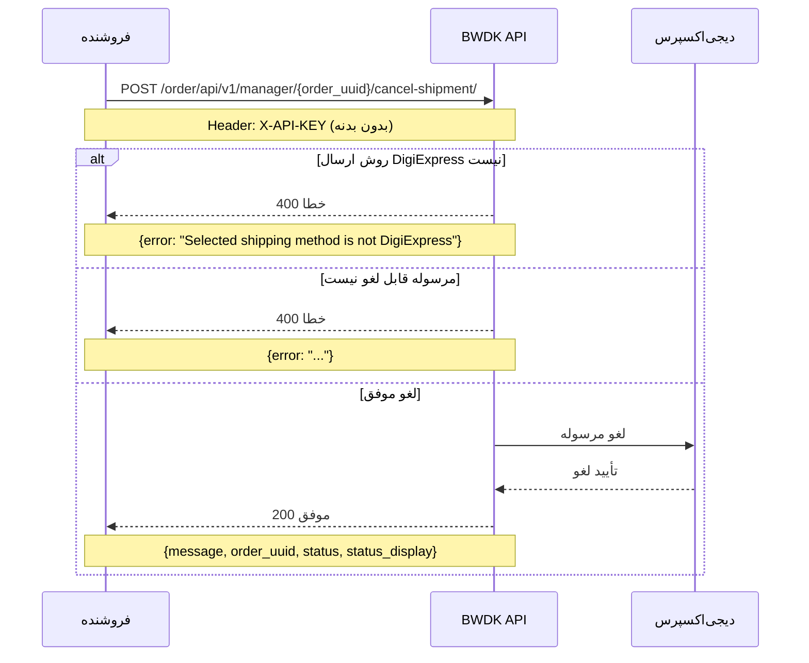
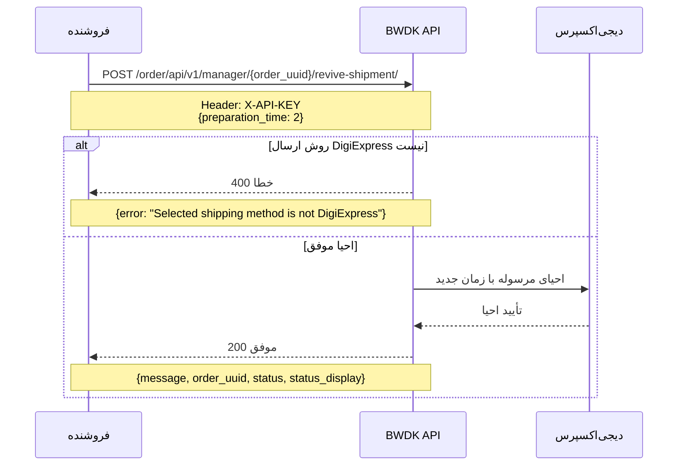

# bwdk_sdk.OrderShippingApi

All URIs are relative to *https://bwdk-backend.digify.shop*

Method | HTTP request | Description
------------- | ------------- | -------------
[**order_api_v1_manager_cancel_shipment_create**](OrderShippingApi.md#order_api_v1_manager_cancel_shipment_create) | **POST** /order/api/v1/manager/{order_uuid}/cancel-shipment/ | Cancel Shipment
[**order_api_v1_manager_change_shipping_method_update**](OrderShippingApi.md#order_api_v1_manager_change_shipping_method_update) | **PUT** /order/api/v1/manager/{order_uuid}/change-shipping-method/ | Change Shipping Method
[**order_api_v1_manager_revive_shipment_create**](OrderShippingApi.md#order_api_v1_manager_revive_shipment_create) | **POST** /order/api/v1/manager/{order_uuid}/revive-shipment/ | Revive Shipment


# **order_api_v1_manager_cancel_shipment_create**
> MerchantOrderCancelShipmentResponse order_api_v1_manager_cancel_shipment_create(order_uuid)

Cancel Shipment

<div dir="rtl" style="text-align: right;">

لغو مرسوله دیجی‌اکسپرس

## توضیحات

این endpoint برای لغو یک مرسوله ثبت‌شده در سرویس دیجی‌اکسپرس استفاده می‌شود. پس از لغو موفق، مرسوله از صف ارسال خارج می‌شود.

نیاز به **API_KEY** فروشنده دارد.

## شرایط لغو

* سفارش باید دارای روش ارسال **DigiExpress** باشد
* مرسوله باید در وضعیت **در انتظار تحویل به پیک** (Request for Pickup) باشد

</div>




### Example

* Api Key Authentication (MerchantAPIKeyAuth):

```python
import bwdk_sdk
from bwdk_sdk.models.merchant_order_cancel_shipment_response import MerchantOrderCancelShipmentResponse
from bwdk_sdk.rest import ApiException
from pprint import pprint

# Defining the host is optional and defaults to https://bwdk-backend.digify.shop
# See configuration.py for a list of all supported configuration parameters.
configuration = bwdk_sdk.Configuration(
    host = "https://bwdk-backend.digify.shop"
)

# The client must configure the authentication and authorization parameters
# in accordance with the API server security policy.
# Examples for each auth method are provided below, use the example that
# satisfies your auth use case.

# Configure API key authorization: MerchantAPIKeyAuth
configuration.api_key['MerchantAPIKeyAuth'] = os.environ["API_KEY"]

# Uncomment below to setup prefix (e.g. Bearer) for API key, if needed
# configuration.api_key_prefix['MerchantAPIKeyAuth'] = 'Bearer'

# Enter a context with an instance of the API client
with bwdk_sdk.ApiClient(configuration) as api_client:
    # Create an instance of the API class
    api_instance = bwdk_sdk.OrderShippingApi(api_client)
    order_uuid = UUID('38400000-8cf0-11bd-b23e-10b96e4ef00d') # UUID | 

    try:
        # Cancel Shipment
        api_response = api_instance.order_api_v1_manager_cancel_shipment_create(order_uuid)
        print("The response of OrderShippingApi->order_api_v1_manager_cancel_shipment_create:\n")
        pprint(api_response)
    except Exception as e:
        print("Exception when calling OrderShippingApi->order_api_v1_manager_cancel_shipment_create: %s\n" % e)
```


### Parameters


Name | Type | Description  | Notes
------------- | ------------- | ------------- | -------------
 **order_uuid** | **UUID**|  | 

### Return type

[**MerchantOrderCancelShipmentResponse**](MerchantOrderCancelShipmentResponse.md)

### Authorization

[MerchantAPIKeyAuth](../README.md#MerchantAPIKeyAuth)

### HTTP request headers

 - **Content-Type**: Not defined
 - **Accept**: application/json

### HTTP response details

| Status code | Description | Response headers |
|-------------|-------------|------------------|
**200** |  |  -  |
**400** |  |  -  |
**500** |  |  -  |

[[Back to top]](#) [[Back to API list]](../README.md#documentation-for-api-endpoints) [[Back to Model list]](../README.md#documentation-for-models) [[Back to README]](../README.md)

# **order_api_v1_manager_change_shipping_method_update**
> OrderDetail order_api_v1_manager_change_shipping_method_update(order_uuid, order_detail)

Change Shipping Method

<div dir="rtl" style="text-align: right;">

تغییر روش ارسال سفارش

## توضیحات

این endpoint به فروشنده اجازه می‌دهد روش ارسال یک سفارش را تغییر دهد. این عملیات معمولاً زمانی استفاده می‌شود که فروشنده بخواهد از DigiExpress به روش ارسال پیش‌فرض (یا بالعکس) تغییر دهد.

نیاز به **API_KEY** فروشنده دارد.

## پارامترهای ورودی

* **updated_shipping**: شناسه روش ارسال جدید
* **preparation_time** (اختیاری): زمان آماده‌سازی (روز) برای DigiExpress

</div>


### Example

* Api Key Authentication (MerchantAPIKeyAuth):

```python
import bwdk_sdk
from bwdk_sdk.models.order_detail import OrderDetail
from bwdk_sdk.rest import ApiException
from pprint import pprint

# Defining the host is optional and defaults to https://bwdk-backend.digify.shop
# See configuration.py for a list of all supported configuration parameters.
configuration = bwdk_sdk.Configuration(
    host = "https://bwdk-backend.digify.shop"
)

# The client must configure the authentication and authorization parameters
# in accordance with the API server security policy.
# Examples for each auth method are provided below, use the example that
# satisfies your auth use case.

# Configure API key authorization: MerchantAPIKeyAuth
configuration.api_key['MerchantAPIKeyAuth'] = os.environ["API_KEY"]

# Uncomment below to setup prefix (e.g. Bearer) for API key, if needed
# configuration.api_key_prefix['MerchantAPIKeyAuth'] = 'Bearer'

# Enter a context with an instance of the API client
with bwdk_sdk.ApiClient(configuration) as api_client:
    # Create an instance of the API class
    api_instance = bwdk_sdk.OrderShippingApi(api_client)
    order_uuid = UUID('38400000-8cf0-11bd-b23e-10b96e4ef00d') # UUID | 
    order_detail = bwdk_sdk.OrderDetail() # OrderDetail | 

    try:
        # Change Shipping Method
        api_response = api_instance.order_api_v1_manager_change_shipping_method_update(order_uuid, order_detail)
        print("The response of OrderShippingApi->order_api_v1_manager_change_shipping_method_update:\n")
        pprint(api_response)
    except Exception as e:
        print("Exception when calling OrderShippingApi->order_api_v1_manager_change_shipping_method_update: %s\n" % e)
```


### Parameters


Name | Type | Description  | Notes
------------- | ------------- | ------------- | -------------
 **order_uuid** | **UUID**|  | 
 **order_detail** | [**OrderDetail**](OrderDetail.md)|  | 

### Return type

[**OrderDetail**](OrderDetail.md)

### Authorization

[MerchantAPIKeyAuth](../README.md#MerchantAPIKeyAuth)

### HTTP request headers

 - **Content-Type**: application/json, application/x-www-form-urlencoded, multipart/form-data
 - **Accept**: application/json

### HTTP response details

| Status code | Description | Response headers |
|-------------|-------------|------------------|
**200** |  |  -  |

[[Back to top]](#) [[Back to API list]](../README.md#documentation-for-api-endpoints) [[Back to Model list]](../README.md#documentation-for-models) [[Back to README]](../README.md)

# **order_api_v1_manager_revive_shipment_create**
> MerchantOrderReviveShipmentResponse order_api_v1_manager_revive_shipment_create(order_uuid, revive_shipment=revive_shipment)

Revive Shipment

<div dir="rtl" style="text-align: right;">

احیای مرسوله دیجی‌اکسپرس

## توضیحات

این endpoint برای احیای (reactivate) یک مرسوله دیجی‌اکسپرس که قبلاً لغو شده یا در وضعیت غیرفعال است استفاده می‌شود. با ارسال `preparation_time` (زمان آماده‌سازی بر حسب روز)، زمان جدید آماده بودن بار تنظیم می‌شود.

نیاز به **API_KEY** فروشنده دارد.

## پارامترهای ورودی

* **preparation_time** (اختیاری، پیش‌فرض: ۲): تعداد روز تا آماده‌شدن بار برای تحویل به پیک

## شرایط

* سفارش باید دارای روش ارسال **DigiExpress** باشد
* مرسوله باید در وضعیت قابل احیا باشد

</div>




### Example

* Api Key Authentication (MerchantAPIKeyAuth):

```python
import bwdk_sdk
from bwdk_sdk.models.merchant_order_revive_shipment_response import MerchantOrderReviveShipmentResponse
from bwdk_sdk.models.revive_shipment import ReviveShipment
from bwdk_sdk.rest import ApiException
from pprint import pprint

# Defining the host is optional and defaults to https://bwdk-backend.digify.shop
# See configuration.py for a list of all supported configuration parameters.
configuration = bwdk_sdk.Configuration(
    host = "https://bwdk-backend.digify.shop"
)

# The client must configure the authentication and authorization parameters
# in accordance with the API server security policy.
# Examples for each auth method are provided below, use the example that
# satisfies your auth use case.

# Configure API key authorization: MerchantAPIKeyAuth
configuration.api_key['MerchantAPIKeyAuth'] = os.environ["API_KEY"]

# Uncomment below to setup prefix (e.g. Bearer) for API key, if needed
# configuration.api_key_prefix['MerchantAPIKeyAuth'] = 'Bearer'

# Enter a context with an instance of the API client
with bwdk_sdk.ApiClient(configuration) as api_client:
    # Create an instance of the API class
    api_instance = bwdk_sdk.OrderShippingApi(api_client)
    order_uuid = UUID('38400000-8cf0-11bd-b23e-10b96e4ef00d') # UUID | 
    revive_shipment = bwdk_sdk.ReviveShipment() # ReviveShipment |  (optional)

    try:
        # Revive Shipment
        api_response = api_instance.order_api_v1_manager_revive_shipment_create(order_uuid, revive_shipment=revive_shipment)
        print("The response of OrderShippingApi->order_api_v1_manager_revive_shipment_create:\n")
        pprint(api_response)
    except Exception as e:
        print("Exception when calling OrderShippingApi->order_api_v1_manager_revive_shipment_create: %s\n" % e)
```


### Parameters


Name | Type | Description  | Notes
------------- | ------------- | ------------- | -------------
 **order_uuid** | **UUID**|  | 
 **revive_shipment** | [**ReviveShipment**](ReviveShipment.md)|  | [optional] 

### Return type

[**MerchantOrderReviveShipmentResponse**](MerchantOrderReviveShipmentResponse.md)

### Authorization

[MerchantAPIKeyAuth](../README.md#MerchantAPIKeyAuth)

### HTTP request headers

 - **Content-Type**: application/json, application/x-www-form-urlencoded, multipart/form-data
 - **Accept**: application/json

### HTTP response details

| Status code | Description | Response headers |
|-------------|-------------|------------------|
**200** |  |  -  |
**400** |  |  -  |
**500** |  |  -  |

[[Back to top]](#) [[Back to API list]](../README.md#documentation-for-api-endpoints) [[Back to Model list]](../README.md#documentation-for-models) [[Back to README]](../README.md)

